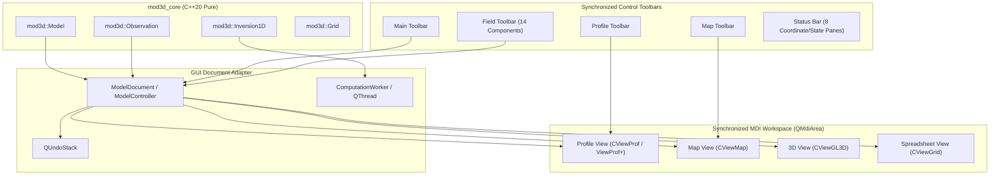

# Phase 6: Modern Qt 6 GUI Implementation Plan
## Exact Legacy Mod3D Reproduction & Modernization Specification

---

## 1. Executive Summary & Legacy Fidelity Mandate

### 1.1 Objective
The purpose of Phase 6 is to build a complete, state-of-the-art, cross-platform graphical user interface for **Mod3D** using **Qt 6 (C++20)**, replicating the exact user experience, interactive modeling paradigms, view synchronization, mouse/keyboard gestures, menus, toolbars, and dialog controls from the legacy MFC Windows application (`legacy/mfc_framework/`).

### 1.2 Fidelity Commitment
> [!IMPORTANT]
> **Legacy Fidelity Directive**: The legacy Mod3D interface embodies decades of refined geophysical modeling workflow. The new Qt 6 interface must reproduce **100% of legacy capabilities, view behaviors, hit-testing rules, mouse editing mechanics, keyboard shortcuts, toolbars, and dialog configurations** without dropping features or altering established workflows.

### 1.3 Architectural Decoupling Guarantee
To guarantee long-term maintainability and testability:
1. **Zero GUI Bleed into Core**: The core library (`mod3d_core`, including `Model`, `Body`, `ColumnPoint`, `Facet3Pt`, `Grid`, `Observation`, `Inversion1D`) remains strictly non-GUI, standard C++20 with zero dependencies on Qt or OpenGL.
2. **Controller/Document Adapter Layer**: The Qt 6 GUI communicates with `mod3d_core` through a dedicated document/controller layer (`ModelDocument` / `ModelController`), exposing clean Qt signals/slots for model mutation, field computation, undo/redo, and view synchronization.
3. **Hardware Acceleration**: 3D visualization and high-performance 2D map/profile rendering utilize modern Qt 6 rendering abstractions (`QOpenGLWidget` with modern shader pipelines, and hardware-accelerated `QPainter` / `QGraphicsScene`).

---

## 2. System Architecture & View Synchronization



### 2.1 MDI Workspace Architecture
- **Host Window (`MainWindow : QMainWindow`)**: Contains a central `QMdiArea` in `SubWindowView` or `TabbedView` mode (supporting legacy Cascade, Tile Horizontally, Tile Vertically, Arrange Icons).
- **Multi-View Synchronization**: Multiple views can be opened on the same document simultaneously (e.g., perpendicular profiles, plan map, and 3D perspective).
  - Editing a vertex in **Profile View** instantly updates the active profile track in **Map View**, updates 3D body geometry in **3D View**, and recalculates field curves in real time.
  - Moving the active profile slider in **Profile View** shifts the profile crosshair line in **Map View** and repositioning the 2D cross-section plane in **3D View**.
  - Adjusting view parameters or physical properties emits notification signals across all attached views.

---

## 3. The 4 Primary Synchronized Views

### 3.1 Profile View (`ProfileView` / Legacy `CViewProf` & `CViewProfPlus`)
The primary interactive cross-sectional modeling interface.

```
+-----------------------------------------------------------------------------------+
| Profile View: Row 25 (Y = 12,500 m) [E-W Orientation]                             |
+-----------------------------------------------------------------------------------+
| Field Curves Pane:                                                                |
|  [+] Modeled Gz (solid blue)      [x] Measured Gz (red crosses)                   |
|  [--] Diff Gz (dashed magenta)   RMS: 0.24 mGal [v]  DRV: 0.08 [v]                |
|  |                                                                                |
|  |     _/\_                                                                       |
|  |____/    \______x_______x____                                                   |
+--+--------------------------------------------------------------------------------+
|  | <--- Splitter (CRS_OVER_DIV) --->                                              |
+--+--------------------------------------------------------------------------------+
| Geological Cross-Section Pane:                                                    |
|  Z (m)                                                                            |
|  500 | ~~~~~ Relief Surface (DEM) ~~~~~~~~~~~~~~~~~~~~~~~~~~~~~~~~~~~~~~~~~~~~~~  |
|      |        /----------------\             [Body 1: Sandstone, ro=2400]         |
|    0 |       /   * (Vertex)     \                                                 |
|      |      /                    \________   [Body 2: Granite, ro=2670]           |
| -500 |     /_____________________________/                                        |
|      |                                                                            |
|-1000 | ----------------- Model Bottom Boundary (Zmin) --------------------------  |
+------+----------------------------------------------------------------------------+
|      | 0            2500           5000           7500          10000       X (m) |
+-----------------------------------------------------------------------------------+
```

#### Dual-Pane Layout & Splitter
- **Upper Pane (Field Curves Canvas)**:
  - Renders 1D cross-sectional profiles of all active potential fields along the current profile line.
  - Line styles:
    * **Modeled Field (Gravity & Magnetics)**: Solid line (`Qt::SolidLine`, configurable width/pen).
    * **Modeled Field (Gravity Tensor components)**: Dashed line (`Qt::DashLine`).
    * **Measured Field**: Discrete cross markers (`+` / `x`).
    * **Difference Field**: Dashed line (`Qt::DashLine`).
  - Interactive Field Axis on right/left with auto-scale or manual range.
  - **RMS & Derivative Indicators**:
    * RMS value display with directional indicator icons (green down-arrow for convergence/improvement, red up-arrow for divergence).
    * DRV ("fake derivative") indicator approximating error slope: $\sum \left( \frac{\Delta F}{\Delta x} + \frac{\Delta F}{\Delta y} \right)$.
- **Lower Pane (Geological Cross-Section Canvas)**:
  - Renders vertical grid columns representing model nodes.
  - Renders Digital Elevation Model (DEM) topographic surface at the top.
  - Renders horizontal model bottom range ($Z_{min}$).
  - Renders polyhedral body polygons clipped to the current profile slice.
  - Renders ghost contours of bodies from **Previous Profile** (`m_plgPrev`, dashed/custom pen) and **Next Profile** (`m_plgNext`, dotted/custom pen) for spatial continuity.
  - Renders geological guidelines, well projections (within display radius), and lithological columns.
- **Splitter (`CRS_OVER_DIV`)**:
  - Interactive horizontal divider allowing the user to adjust the vertical split between field curves and geological section.

---

### 3.2 Map View (`MapView` / Legacy `CViewMap`)
The 2D horizontal planimetric overview of the survey area.

```
+-----------------------------------------------------------------------------------+
| Map View (X: [0, 20000 m], Y: [0, 15000 m])                                       |
+-----------------------------------------------------------------------------------+
|  Y (m)                                                                            |
| 15000 | +  +  +  +  +  +  +  +  +  +  +  +  +  +  +   [DEM Relief / Field Bitmap] |
|       | +  +  +  +  +  +  +  +  +  +  +  +  +  +  +                               |
| 10000 | +  +  +  ==============[ Active Profile Line (Row 25) ]=================  |
|       | +  +  +  +  +  +  +  ( O Well-1 )   +  +  +                               |
|  5000 | +  +  +  +  /---------\  +  +  +  +  +  +  +   [Body Outlines Overlay]    |
|       | +  +  +  +  \_________/  +  +  +  +  +  +  +   [Contour Lines Overlay]    |
|     0 | +  +  +  +  +  +  +  +  +  +  +  +  +  +  +                               |
+-------+---------------------------------------------------------------------------+
|       | 0          5000         10000        15000       20000              X (m) |
+-----------------------------------------------------------------------------------+
```

#### Layer Stack (Bottom to Top)
1. **Base Raster Layer**:
   - Georeferenced DEM relief bitmap or imported geological map/satellite image.
   - Smooth 2D color raster interpolation of any calculated, measured, or difference potential field grid.
   - Quality slider adjustment (`IDD_DLG_VIEW_MAP` image quality) controlling raster sampling resolution for high-speed redraw during interactive modeling.
2. **Isoline / Contour Layer**:
   - High-precision Marching Squares contour generation for relief and potential fields.
   - Contour labels with elevation / field values and customizable contour intervals.
3. **Grid Mesh Layer**:
   - Observation station point markers (`+` dots).
   - Horizontal and vertical model column grid lines.
4. **Model Outlines Layer**:
   - Projected 2D horizontal footprint outlines of all polyhedral bodies.
5. **Geological Infrastructure & Wells**:
   - Projected borehole well locations with deviation traces and lithology color tags.
   - Digitized geological check marks and structural guidelines.
6. **Active Profile Tracker**:
   - Prominent crosshair line indicating the currently selected profile in **Profile View**.
   - Profile direction indicator arrow (West-to-East or South-to-North).
   - Dragging the tracker line in Map View navigates Profile View directly to that slice.

---

### 3.3 3D OpenGL View (`GL3DView` / Legacy `CViewGL3D`)
Hardware-accelerated 3D inspection and interactive spatial modeling view.

#### Dual Operating Modes
1. **Rendering Mode (Visualization & Spatial Inspection)**:
   - **Trackball 3D Rotation**: Left Mouse Button drag rotates model smoothly in 3D.
   - **Pan / Translation**: `Shift` + Left Mouse Button drag shifts model along camera plane.
   - **Continuous Zoom**: Mouse Wheel or `Ctrl` + mouse drag zooms camera in/out.
   - **Discrete Keyboard Controls**:
     * `Left` / `Right` Arrow keys: Rotate model around vertical axis.
     * `Up` / `Down` Arrow keys: Zoom in / out.
     * `Page Up` / `Page Down`: Shift model vertically along Z axis.
   - **Preset Viewpoints**:
     * `E`: Look East-to-West.
     * `W`: Look West-to-East.
     * `N`: Look North-to-South.
     * `S`: Look South-to-North.
     * `M`: Top-down Map View.
   - **Context Action**: Right Mouse Button click anywhere opens the **3D View Properties** sheet (`IDD_DLG_3DVIEW_SETTINGS`).

2. **Selection Mode (Interactive 3D Direct Vertex Editing)**:
   - Allows direct manipulation of subsurface body geometry directly in 3D perspective!
   - **Raycasting / Screen-Space Picking**: Uses selection sensitivity threshold ($N$ pixels) to detect the nearest body vertex under the mouse.
   - **Vertical Vertex Dragging in 3D**: Clicking on a body vertex and dragging with Left Mouse Button moves that specific vertex vertically along its column line.
   - **Camera Controls during Selection Mode**:
     * `Ctrl` + Left Mouse Button drag: Zooms the model.
     * `Ctrl` + `Shift` + Left Mouse Button drag: Rotates the model.
   - Real-time recalculation of potential fields occurs simultaneously as the vertex moves in 3D space!

#### 3D Rendering Capabilities
- **Shading Modes**: Wireframe (`SHD_WIREFRAME`) or Solid Filled Polygons (`SHD_FILLEDPOLY`).
- **Transparency & Alpha Blending**: Individual bodies support floating-point alpha transparency $\alpha \in [0.0, 1.0]$ for seeing through overburden into deep structures.
- **Topographic Relief Mesh**: 3D textured DEM surface showing terrain draped over the subsurface bodies.
- **Active Profile Slice Plane**: 3D semi-transparent vertical plane displaying the exact 2D cut corresponding to the current Profile View.
- **Well Log Cylinders**: 3D solid or wireframe tubular representations of boreholes with log curve ribbons and lithological stratification colors.

---

### 3.4 Spreadsheet View (`SpreadsheetView` / Legacy `CViewGrid`)
Tabular numerical inspection of:
- Grid nodes (row, col, X, Y, Z, terrain elevation).
- Computed, measured, and difference field values at every station.
- Vertex coordinates for each body slice.
- Full clipboard copy/paste support for Excel/CSV interoperability.

---

## 4. Exhaustive Interactive Editing Specification

The Profile View interactive editing engine is the heart of Mod3D. It must be reproduced with exact geometric constraints and cursor behaviors.

```
+------------------------------------------------------------------------------------+
| CURSOR HIT-TESTING & INTERACTIVE GESTURE MATRIX                                     |
+----------------------+---------------------------+---------------------------------+
| Cursor State         | Visual Icon               | Trigger Condition & Action      |
+----------------------+---------------------------+---------------------------------+
| CRS_NORMAL           | Standard Arrow            | Empty space outside model       |
| CRS_OVER_LINE        | Horizontal Crossbar Line  | Over vertical grid line (empty) |
| CRS_OVER_VERTEX      | Double Vertical Arrow     | Over movable body vertex        |
| CRS_OVER_VERTEX_LOCK | Arrow with Lock/Bar       | Over locked body vertex         |
| CRS_OVER_BODY        | Hand / Solid Polygon Icon | Over interior of body polygon   |
| CRS_OVER_BODY_LINE   | Double Horizontal Arrow   | Over vertical side edge of body |
| CRS_OVER_DIV         | Splitter Resize Cursor    | Over field/cross-section split  |
| CRS_OVER_SCBAR_H/V   | Axis Scale Cursor         | Over coordinate axis scale area |
+----------------------+---------------------------+---------------------------------+
```

### 4.1 Vertex Vertical Dragging (`CRS_OVER_VERTEX`)
- **Trigger**: Mouse hovers within screen snapping distance of an existing body vertex on a grid column.
- **Action**: Left Mouse Button Down + Vertical Drag.
- **Constraints**:
  1. Vertex moves **strictly along its vertical column line** $(X_i, Y_j, Z)$.
  2. Vertex cannot pass above the DEM relief surface (unless explicitly joined to relief).
  3. Vertex cannot penetrate below the model bottom boundary ($Z_{min}$).
  4. Vertex cannot cross or invert against another vertex of the same body column (upper boundary must remain $\ge$ lower boundary).
  5. Vertex cannot invade or cross into an adjacent body unless a connection is triggered.
- **Real-Time Update**: In real-time computation mode, each pixel moved recalculates the facet delta and updates the modeled curves dynamically.

### 4.2 Body Side Extension (`CRS_OVER_BODY_LINE`)
- **Trigger**: Mouse hovers over the outermost vertical edge of a body.
- **Action**: Left Mouse Button Down + Horizontal Drag to the adjacent grid column.
- **Mechanics**:
  - Dragging **outward** (away from body): Creates a new body slice on the adjacent column.
    * New slice thickness is determined by `IDD_DLG_BODY_CREATION` rules:
      $$\text{NewThickness} = \text{BodyCreationRatio} \times \text{OldThickness}$$
    * The new slice is vertically centered at the cursor position.
  - Dragging **inward** (into body): Collapses and deletes the edge column slice.
  - Merging: If dragged into a separate disconnected part of the *same* body on that column, the two parts automatically merge into a single continuous polygon.

### 4.3 Freehand Boundary Reshaping Gesture
- Clicking a vertex and dragging continuously across multiple columns allows smooth, natural geological drawing. As the mouse passes each column line, the vertex at that column snaps to the mouse height, allowing rapid sculpting of stratigraphic interfaces.

### 4.4 Boundary Merging & Splitting
- **Vertex Connection (Snap to Neighbor / Relief)**:
  - Dragging a body vertex into contact with a neighboring body vertex or the terrain surface merges them into a **common boundary**.
  - Subsequent moves of this vertex simultaneously adjust the boundaries of both bodies, guaranteeing topological consistency without voids or overlaps.
- **Vertex Disconnection (`Ctrl + Drag`)**:
  - Holding `Ctrl` while left-clicking and dragging a shared vertex disconnects the current body's vertex from the neighbor, allowing independent geometry manipulation.
- **Body Pinch-Out (Wedge Formation)**:
  - Dragging the upper boundary vertex down to meet the lower boundary vertex on the same column merges them into a single point, forming a razor-sharp geological pinch-out wedge.

### 4.5 Vertical Body Translation (`Shift + Drag`)
- **Trigger**: Hovering over the body interior (`CRS_OVER_BODY`).
- **Action**: Holding `Shift` + Left Mouse Button Down + Dragging vertically translates the entire body up or down as a rigid unit across all active columns on the profile.

### 4.6 Navigation & Keyboard Shortcut Matrix

| Key / Action | Scope | Function |
| :--- | :--- | :--- |
| `N` | Profile View | Navigate to **Next Profile** ($+1$ slice) |
| `P` | Profile View | Navigate to **Previous Profile** ($-1$ slice) |
| `H` | Profile View | Switch profile orientation to **East-West** (Horizontal) |
| `V` | Profile View | Switch profile orientation to **South-North** (Vertical) |
| `E` | Profile View | Jump to profile containing **Global Field Extreme** |
| `I` | Profile View | Jump to profile containing **Local Field Minimum** |
| `A` | Profile View | Jump to profile containing **Local Field Maximum** |
| `Ctrl + Shift + N` | Profile View | **Copy Body to Next Profile** |
| `Ctrl + Shift + P` | Profile View | **Copy Body to Previous Profile** |
| `Mouse Wheel` | Profile / Map / 3D | Smooth Zoom In / Zoom Out |
| `Arrow Keys` | Profile View | Step across profile grid columns |
| `Ctrl + N` / `Ctrl + O` / `Ctrl + S` | Global | New Document / Open / Save |
| `Ctrl + P` | Global | Print Active View |
| `F1` | Global | Context Help |

---

## 5. Exhaustive Menus, Context Menus & Toolbars Mapping

### 5.1 Main Menu Bar Hierarchy

```
File
├── New (Ctrl+N)
├── Open... (Ctrl+O)
├── Close
├── Save (Ctrl+S)
├── Save As...
├── -----------------------------
├── Import ►
│   ├── Field (ASCII Grid / Geosoft / Surfer)
│   ├── Grid (DEM Elevation Grid)
│   ├── Bitmap (Georeferenced Image: BMP, TIFF, JPG, PNG)
│   ├── Guideline (ASCII Geological Guideline Vectors)
│   ├── Body (Exported Mod3D Body Geometries)
│   ├── Well (Borehole Deviations & Multi-Channel LAS/ASCII Logs)
│   └── 3D Data
├── Export ►
│   ├── Modeled Field (ASCII / Surfer Grid)
│   ├── Bitmap (High-Resolution View Render)
│   ├── Guideline
│   └── Body
├── -----------------------------
├── Print... (Ctrl+P)
├── Print Preview
├── Print Setup...
├── -----------------------------
├── Auto Open Last Document (Toggle)
├── Recent File List (MRU 1..10)
└── Exit (Ctrl+Q)

View
├── Mod3D Toolbar (Toggle)
├── Profile Toolbar (Toggle)
├── Map Toolbar (Toggle)
├── Field Toolbar (Toggle)
├── Status Bar (Toggle)
├── -----------------------------
├── Set Field Indicator...
└── Plane Simulator...

Model
├── Object Manager... (Tree view of all imported guidelines, wells, rasters)
├── Field Grid... (Grid dimensions and node inspector)
├── Properties... (IDD_DLG_MODEL: Extents, constraints, descriptions)
├── -----------------------------
├── Import Observation... (Load DEM or station survey)
├── Define Observation... (Create regular observation mesh)
├── Change Vertical Range... (IDD_DLG_MODEL_RANGE_Z: Zmin, Zmax)
└── Inducing Field... (IDD_DLG_MODEL_INDUCING_FIELD: T0, Inclination, Declination)

Body
├── Properties... (IDD_DLG_BODY_GRAV / MAG / DRAW / COMP / DESCR)
├── Fill (Toggle hatch/color fill)
├── -----------------------------
├── Copy to Previous Profile (Ctrl+Shift+P)
├── Copy to Next Profile (Ctrl+Shift+N)
├── -----------------------------
├── Remove (Delete selected edge/column)
├── Remove from Profile (Delete body completely from current profile)
├── Move Body... (IDD_DLG_BODY_MOVE: dx, dy, dz manual shift)
├── -----------------------------
├── Edit Bodies... (IDD_DLG_MODEL_EDIT_BODIES: Reorder, rename, delete)
├── Body Creation Properties... (IDD_DLG_BODY_CREATION)
├── -----------------------------
├── Invert Density (Execute 1D density fitting for active body)
└── Density Inversion Properties... (IDD_DLG_FIT_1D)

Compute
├── Compute (Full manual recomputation of all active field components)
├── Properties... (IDD_DLG_COMPUTE_COMP / GRAV / MAG)
├── Active Field... (IDD_DLG_MODEL_GRD_ACTIVE: Component selection)
├── Activate/Deactivate Grids...
├── -----------------------------
├── Compute Real-Time (Toggle real-time update during drag)
├── -----------------------------
├── Vertex Fit Properties... (IDD_DLG_FIT_1D)
└── Density Inversion Properties... (IDD_DLG_FIT_1D)

Window
├── New Profile Window (Ctrl+W, P)
├── New Map Window (Ctrl+W, M)
├── New 3D Window (Ctrl+W, 3)
├── New Spreadsheet Window (Ctrl+W, S)
├── -----------------------------
├── Cascade
├── Tile Horizontally
├── Tile Vertically
├── Arrange Icons
└── Open Window List (1, 2, 3...)

Help
├── Help Topics (F1)
└── About Mod3D... (IDD_DLG_ABOUT)
```

---

### 5.2 Floating Context Menus

#### 1. Background Profile Menu (`IDR_MENU_FLOAT_PROF`)
*Triggered by RMB click on background/empty area of Profile View:*
- **Next** (`N`): Advance to next profile slice.
- **Previous** (`P`): Step back to previous profile slice.
- **E-W Profile** (`H`): Orient profile along X axis.
- **S-N Profile** (`V`): Orient profile along Y axis.
- **Show Previous**: Toggle ghost overlay of previous profile bodies.
- **Show Next**: Toggle ghost overlay of next profile bodies.
- **Jump to Extreme** (`E`): Jump directly to slice with maximum field error/anomaly.
- **Jump to Min** (`I`): Jump to slice with minimum value.
- **Jump to Max** (`A`): Jump to slice with maximum value.

#### 2. Over-Body Menu (`IDR_MENU_FLOAT_BODY`)
*Triggered by RMB click inside a body polygon:*
- **Properties**: Open multi-tab Body Properties sheet.
- **Fill**: Toggle fill state.
- **Copy to Previous Profile** (`Ctrl+Shift+P`).
- **Copy to Next Profile** (`Ctrl+Shift+N`).
- **Remove**: Remove captured column edge.
- **Remove from Profile**: Strip body from current slice.
- **Move Body...**: Open numerical translation dialog.
- **Edit Bodies...**: Open body hierarchy manager.
- **Body Creation Properties...**: Configure extension rules.
- **Invert Density**: Run 1D density fitting optimization.
- **Density Inversion Properties...**: Configure fitting parameters.

#### 3. Over-Grid-Line Menu (`IDR_MENU_FLOAT_BODY_LINE`)
*Triggered by RMB click on an empty vertical grid line:*
- **Insert New Body**: Create brand-new body at clicked column.
- **Insert Existing Body**: Instantiate another segment of an existing body.
- **Edit Bodies...**: Open body manager.
- **Body Creation Properties...**: Adjust creation defaults.

#### 4. Over-Vertex Menu (`IDR_MENU_FLOAT_VERTEX`)
*Triggered by RMB click directly on a body vertex:*
- **Fit**: Execute 1D automated depth inversion for this vertex.
- **1D Fit Properties...**: Configure Brent/Golden-section fitting criteria.

#### 5. Object Manager Context Menu (`IDR_MENU_OBJMNG`)
*Triggered by RMB click in Object Manager tree:*
- **Properties**: Open object-specific settings (Well, Guideline, Raster).
- **Delete**: Remove object from workspace.
- **Show / Hide**: Toggle visibility.

---

### 5.3 Toolbars & Controls

```
+-----------------------------------------------------------------------------------------------------------------+
| MAIN TOOLBAR:                                                                                                   |
| [New] [Open] [Save] | [Print] | [ZoomIn] [ZoomOut] [ZoomRect] [FitPage] | [MapWnd] [ProfWnd] [3DWnd] | [EqualAxes] |
| [TileV] [TileH] | [COMPUTE] | [Digitize] [Redraw]                                                               |
+-----------------------------------------------------------------------------------------------------------------+
| PROFILE TOOLBAR:                                                                                                |
| [VertProfile (S-N)] [HorzProfile (E-W)] | [PrevProfile] [NextProfile] | [ShowPrev] [ShowNext] | [ShowGridLines] |
+-----------------------------------------------------------------------------------------------------------------+
| MAP TOOLBAR:                                                                                                    |
| [ObsPoints] [ShowProfiles] [ReliefContours] [ReliefBitmap] [Objects] [BodyContours]                             |
+-----------------------------------------------------------------------------------------------------------------+
| FIELD TOOLBAR:                                                                                                  |
| [Contours] [Bitmaps] | [Modeled] [Measured] [Diff] | [FieldAxis] |                                             |
| Gravity:   [Gx] [Gy] [Gz] [G_tot]                                                                               |
| Magnetics: [Mx] [My] [Mz] [M_tot]                                                                               |
| Tensors:   [Txx] [Tyy] [Tzz] [Txy] [Txz] [Tyz]                                                                  |
+-----------------------------------------------------------------------------------------------------------------+
```

### 5.4 Status Bar Specification (8 Synchronized Panes)

| Pane Index | Indicator ID | Purpose | Update Frequency |
| :---: | :--- | :--- | :--- |
| **0** | `ID_INDICATOR_MESSAGE` | Long descriptive menu/command help strings | Instantaneous on hover |
| **1** | `ID_INDICATOR_PROGRESS` | Progress bar or `%` computation progress | During forward modeling / inversion |
| **2** | `ID_INDICATOR_ROW` | Current active grid row index (`row: 24`) | On profile switch or mouse move |
| **3** | `ID_INDICATOR_COL` | Current active grid column index (`col: 56`) | On mouse column move |
| **4** | `ID_INDICATOR_X` | Real-world X coordinate in survey units (`x: 14500.0 m`) | Real-time mouse tracking |
| **5** | `ID_INDICATOR_Y` | Real-world Y coordinate in survey units (`y: 8200.0 m`) | Real-time mouse tracking |
| **6** | `ID_INDICATOR_Z` | Real-world Z depth / elevation (`z: -420.5 m`) | Real-time mouse tracking |
| **7** | `ID_INDICATOR_FIELD` | Field value at active cursor station (`Gz: 14.82 mGal`) | Real-time station query |

---

## 6. Exhaustive Dialog & Property Sheet Inventory (100% Mapping)

Every dialog and property sheet identified in `legacy/mfc_framework/Mod3D.rc` and `legacy/dialogs/` is mapped to its modern Qt 6 equivalent.

```
+-------------------------------------------------------------------------------------------------------------------+
| LEGACY DIALOG TO QT 6 REPLACEMENT INVENTORY                                                                       |
+-----+----------------------------------+-----------------------------+--------------------------------------------+
| No. | Legacy MFC Resource ID           | Modern Qt 6 Class           | Purpose & Controls                         |
+-----+----------------------------------+-----------------------------+--------------------------------------------+
| 1   | IDD_DLG_MODEL                    | ModelPropertiesDialog       | Model boundaries, extension, motion rules  |
| 2   | IDD_DLG_MODEL_DEF_OBS            | DefineObservationDialog     | Regular survey grid generator (X, Y, dX, dY)|
| 3   | IDD_DLG_OBSERVATIONS             | ObservationsDialog          | Observation dataset manager                |
| 4   | IDD_DLG_MODEL_RANGE_Z            | VerticalRangeDialog         | Zmin, Zmax, and vertical aspect scaling    |
| 5   | IDD_DLG_BODY_GRAV                | BodyGravityPage             | Body density and 3D density gradient vector|
| 6   | IDD_DLG_BODY_MAG                 | BodyMagneticsPage           | Susceptibility & remanent magnetization    |
| 7   | IDD_DLG_BODY_DRAW                | BodyDrawPage                | Pens, brush, transparency alpha, 3D toggle |
| 8   | IDD_DLG_BODY_COMPUTATION         | BodyComputationPage         | Active in forward calc, locked flag        |
| 9   | IDD_DLG_BODY_DESCRIPTION         | BodyDescriptionPage         | ID, Name, geological notes                 |
| 10  | IDD_DLG_BODY_CREATION            | BodyCreationDialog          | Side extension rules, thickness ratio      |
| 11  | IDD_DLG_BODY_MOVE                | BodyMoveDialog              | Numerical 3D translation (dx, dy, dz)      |
| 12  | IDD_DLG_MODEL_EDIT_BODIES        | EditBodiesDialog            | Layer list, reorder, visibility, delete   |
| 13  | IDD_DLG_MODEL_INSERT_EXISTING_BODY| InsertExistingBodyDialog    | Add another segment of existing body       |
| 14  | IDD_DLG_COMPUTE_COMP             | ComputeCompPage             | Real-time modes, spherical, sub-window     |
| 15  | IDD_DLG_COMPUTE_GRAV             | ComputeGravPage             | Sensor elevation, units, reference density |
| 16  | IDD_DLG_COMPUTE_MAG              | ComputeMagPage              | Sensor height, inducing field vector       |
| 17  | IDD_DLG_MODEL_INDUCING_FIELD     | InducingFieldDialog         | Geomagnetic field intensity, Inc, Dec      |
| 18  | IDD_DLG_MODEL_GRD_ACTIVE         | ActiveGridsDialog           | Matrix of active potential field grids     |
| 19  | IDD_DLG_MODEL_FLD_INDICATOR      | FieldIndicatorDialog        | RMS and DRV display options                |
| 20  | IDD_DLG_FIT_1D                   | Fit1DDialog                 | 1D Brent/Golden-section inversion settings |
| 21  | IDD_DLG_VIEW_MAP                 | MapViewPropertiesDialog     | Quality slider, layer checkboxes, scale eq |
| 22  | IDD_DLG_3DVIEW_SETTINGS          | View3DSettingsPage          | Rendering vs selection, step increments    |
| 23  | IDD_DLG_3DVIEW_MODEL             | View3DModelPage             | 3D mesh rendering, lighting, wireframe     |
| 24  | IDD_DLG_3DVIEW_FIELD             | View3DFieldPage             | 3D draped potential field isosurfaces      |
| 25  | IDD_DLG_3DVIEW_AXES              | View3DAxesPage              | 3D bounding coordinate box & axis labels   |
| 26  | IDD_DLG_3DVIEW_SAVE_LOAD         | View3DCameraDialog          | Bookmark and restore 3D camera viewpoints  |
| 27  | IDD_DLG_WELL                     | WellPropertiesDialog        | Multi-channel borehole log visualizer      |
| 28  | IDD_DLG_MODEL_GUIDELINE          | GuidelinePropertiesDialog   | Geological fault/structural vector traces  |
| 29  | IDD_OBJECT_MANAGER               | ObjectManagerDialog         | Dockable tree of workspace entities        |
| 30  | IDD_COLOR_GRAD                   | ColorGradientDialog         | Multi-stop continuous/discrete color ramps |
| 31  | IDD_DLG_PEN                      | PenCustomizerDialog         | Style, width, color picker                 |
| 32  | IDD_DLG_AXIS                     | AxisPropertiesDialog        | Axis ranges, major/minor ticks, labels     |
| 33  | IDD_DLG_PROFILE_SETTINGS         | ProfileSettingsDialog       | Ghost profile display, vertical guides     |
| 34  | IDD_DLG_MODEL_IMPORT_PICTURE     | ImportPictureDialog         | Georeferenced image registration           |
| 35  | IDD_DLG_MODEL_BODY_IMPORT        | BodyImportDialog            | Import body polygons from external files   |
| 36  | IDD_DLG_BODY_EXPORT              | BodyExportDialog            | Export body geometries to disk             |
| 37  | IDD_DLG_FIELD_IMPEXP             | FieldImportExportDialog     | Grid matrix import/export format selector  |
| 38  | IDD_DLG_ABOUT                    | AboutDialog                 | Application version, credits, and license  |
+-----+----------------------------------+-----------------------------+--------------------------------------------+
```

### 6.1 Detailed Parameter Contracts for Critical Dialogs

#### 1. Body Properties Sheet (`QTabWidget` / 5 Tabs)
- **Tab 1: Gravity (`BodyGravityPage`)**:
  - `Density`: Double spin box $[0, 10000]\text{ kg/m}^3$ (default: 2670).
  - `3D Density Gradient Vector`: $g_x, g_y, g_z \text{ [kg/m}^4\text{]}$ (accounting for depth increase with $g_z < 0$).
  - `Gradient Origin`: $X_0, Y_0, Z_0 \text{ [m]}$.
    $$\rho(P) = \rho_{body} + \mathbf{g} \cdot (\mathbf{r}_P - \mathbf{r}_0)$$
- **Tab 2: Magnetics (`BodyMagneticsPage`)**:
  - `Susceptibility`: Dimensionless SI units ($\kappa = \mu_r - 1$).
  - `Remanent Magnetization`:
    * Intensity $J_{rem} \text{ [nT]}$.
    * Inclination $I_{rem} \text{ [deg]}$ ($-90^\circ$ to $+90^\circ$).
    * Declination $D_{rem} \text{ [deg]}$ ($0^\circ$ to $360^\circ$).
- **Tab 3: Drawing (`BodyDrawPage`)**:
  - `Line Pen`: Style, thickness, color for current profile.
  - `Line Next Pen`: Contour style when viewed from previous profile.
  - `Line Prev Pen`: Contour style when viewed from next profile.
  - `Fill Brush`: Hatch pattern / solid fill color.
  - `3D Transparency Alpha`: Slider $\alpha \in [0.0, 1.0]$.
  - `Filled in Profile`: Checkbox.
  - `Visible in 3D`: Checkbox.
- **Tab 4: Computation (`BodyComputationPage`)**:
  - `Active`: Included in potential field summation.
  - `Locked`: Geometry protected against accidental dragging.
- **Tab 5: Description (`BodyDescriptionPage`)**:
  - `ID`: Read-only system identifier.
  - `Name`: Geological unit name (e.g., "Miocene Basalt").
  - `Description`: Multi-line text field for formation notes.

#### 2. Computation Properties Sheet (`QTabWidget` / 3 Tabs)
- **Tab 1: Computation (`ComputeCompPage`)**:
  - `Spherical Computing`: Checkbox (enables Earth curvature spherical corrections).
  - `Real-Time Computation Mode`: Radio group:
    * `None`: Batch only, maximum drawing performance.
    * `Real-Time`: Dynamic updates during active mouse drag.
    * `After Mouse Click`: Updates upon releasing mouse button.
  - `Computation Sub-Window`: Restricts evaluation to a sub-rectangle $[X_1, X_2] \times [Y_1, Y_2]$ to accelerate large models.
- **Tab 2: Gravity (`ComputeGravPage`)**:
  - `Sensor Height over Relief`: $H_{sensor} \ge 0\text{ m}$.
  - `Units & Multipliers`: mGal, $\mu\text{Gal}$, SI units.
  - `Reference Density`: Absolute reduction density $\rho_{ref}$ (default: 2670.0 kg/m$^3$).
  - `Gradients Tensor`: Constant flight elevation vs drape height over relief.
- **Tab 3: Magnetics (`ComputeMagPage`)**:
  - `Sensor Height over Relief`: $H_{mag} \ge 0\text{ m}$.
  - `Inducing Field`: Intensity $T_0\text{ [nT]}$, Inclination $I_0\text{ [deg]}$, Declination $D_0\text{ [deg]}$.

#### 3. 1D Automated Fitting / Inversion Dialog (`Fit1DDialog`)
- `Fitting Field`: Dropdown of difference fields ($\Delta G_z, \Delta T, \Delta T_{zz}$).
- `Optimization Method`: Radio selection:
  - **Brent's Method** (parabolic interpolation + golden section fallback, rapid convergence).
  - **Golden Section Search** (robust linear bracketing).
- `Characteristic Objective Function`:
  - **RMS**: Minimize global root-mean-square anomaly error over the survey.
  - **Derivative**: Minimize global error gradient.
  - **Local Derivative**: Minimize error slope locally at the fitting station.
- `Bracketing Epsilon`: Initial guess step size for interval bracketing.
- `Auto-Bracketing`: Percentage of maximum allowable column depth interval.
- `Tolerance`: Convergence threshold (minimum: $3.0 \times 10^{-8}$).
- `Maximum Iterations`: Integer limit (default: 100).
- `Log File`: Optional file path logging each optimization iteration.

#### 4. Well Log Inspector Dialog (`WellPropertiesDialog`)
- **Well Data Table**: Multi-column tabular view displaying borehole depth, coordinates, and measured channels.
- **Lithology Palette**: Color-coded stratigraphic unit assignments with double-click color customization.
- **Channel Selector**: Checklist choosing active logs for graphical plotting (gamma ray, resistivity, density, sonic).
- **2D Profile Projection Parameters**:
  - `Display Radius [m]`: Orthogonal projection cutoff distance from borehole to profile plane.
  - `Log Plot Radius [m]`: Horizontal width of the plotted log ribbon.
  - `Alignment`: Left, Center, or Right relative to the wellbore trajectory.
- **3D OpenGL Parameters**:
  - `Solid Cylinder vs Wireframe`.
  - `Ring Segment Sampling`: Angular resolution of the well tube.
  - `Pie Slice Angle`: Angular aperture for ribbon display.

---

## 7. Real-Time Geophysical Delta Computation & Inversion Pipeline

### 7.1 The Facet Delta Acceleration Principle
In traditional modeling software, moving a vertex requires recalculating the gravitational/magnetic effect of the entire 3D model, causing unacceptable lag. Mod3D achieves fluid 60 FPS real-time feedback through **Facet Delta Caching**:
1. When vertex $V_k$ at column $(i, j)$ moves to $V_k'$, only the facets attached to column $(i, j)$ and its direct neighbors change.
2. The forward solver calculates only the gravitational contribution of the **difference prism**:
   $$\Delta \mathbf{F} = \mathbf{F}(\text{facet}_{new}) - \mathbf{F}(\text{facet}_{old})$$
3. The observation grids are updated in place:
   $$\mathbf{F}_{modeled} \leftarrow \mathbf{F}_{modeled} + \Delta \mathbf{F}$$
   $$\mathbf{F}_{diff} \leftarrow \mathbf{F}_{measured} - \mathbf{F}_{modeled}$$
4. This reduces computation from $\mathcal{O}(N_{total})$ to $\mathcal{O}(N_{local})$, allowing instantaneous visual updates even on massive models.

### 7.2 Multi-Threaded Inversion Pipeline
For automated 1D vertex and density fitting (`Inversion1D`):
- Optimization runs on a dedicated background thread (`QThread` / `QThreadPool`).
- A non-modal progress dialog displays real-time iteration count, current parameter value, and RMS error curve.
- The user can cancel optimization at any time with immediate rollback to the initial state.

---

## 8. Implementation Strategy, Sub-Phase Breakdown & Deliverables

Phase 6 will be executed across 8 rigorously structured, verifiable sub-phases:

```
+-----------------------------------------------------------------------------------------+
| PHASE 6 IMPLEMENTATION ROADMAP                                                          |
+-----------------------------------------------------------------------------------------+
| Sub-Phase 6.1: Application Shell, MDI Workspace & Document Controller                   |
| Sub-Phase 6.2: Authentic Profile View (ViewProf / ViewProf+)                           |
| Sub-Phase 6.3: Authentic Map View (ViewMap)                                             |
| Sub-Phase 6.4: Authentic 3D OpenGL View (ViewGL3D)                                      |
| Sub-Phase 6.5: Spreadsheet View (ViewGrid)                                             |
| Sub-Phase 6.6: Dialogs & Property Pages Inventory (All 38 Dialogs)                      |
| Sub-Phase 6.7: Real-Time Delta Solver Integration & 1D Inversion Worker                 |
| Sub-Phase 6.8: Complete Legacy Parity Verification & Interactive Acceptance             |
+-----------------------------------------------------------------------------------------+
```

### Sub-Phase 6.1: Application Shell & MDI Framework
- **Deliverables**:
  - `MainWindow`: Qt 6 main window with menu bar, 4 dockable toolbars, status bar with 8 indicator panes.
  - `ModelDocument`: Qt controller wrapping `mod3d::Model` and `mod3d::Observation`.
  - `MdiArea`: Multi-document interface supporting cascading, tiling, and synchronized view management.
- **Validation**: Opening, saving, and creating new Mod3D projects (`.m3d`) with synchronized view windows.

### Sub-Phase 6.2: Authentic Profile View (`ProfileView`)
- **Deliverables**:
  - Splitter pane separating potential field curves from geological cross-section.
  - Field curves renderer (modeled, measured, difference, RMS/DRV badges).
  - Geological section renderer with relief, bottom boundary, bodies, ghost outlines.
  - Complete cursor hit-testing and gesture state machine (vertex drag, side extend, freehand drawing, Ctrl+disconnect, Shift+move).
  - Floating context menus (`IDR_MENU_FLOAT_PROF`, `IDR_MENU_FLOAT_BODY`, `IDR_MENU_FLOAT_BODY_LINE`, `IDR_MENU_FLOAT_VERTEX`).
- **Validation**: Full interactive test verifying exact vertex constraints, edge extensions, and navigation shortcuts.

### Sub-Phase 6.3: Authentic Map View (`MapView`)
- **Deliverables**:
  - High-performance 2D renderer for DEM rasters, field grids, and georeferenced images.
  - Marching Squares isoline/contour engine with numerical elevation/field labels.
  - Layer manager (stations, profiles, contours, bitmaps, objects, body footprints).
  - Active profile tracker line with interactive drag synchronization to Profile View.
- **Validation**: Rendering synthetic and real DEM grids with contour overlays and station points.

### Sub-Phase 6.4: Authentic 3D OpenGL View (`GL3DView`)
- **Deliverables**:
  - `QOpenGLWidget` supporting modern OpenGL (3.3+ Core Profile with legacy compatibility fallback).
  - Rendering mode: Trackball rotation, pan, zoom, preset viewpoints (`E`, `W`, `N`, `S`, `M`).
  - Selection mode: Raycasting vertex picking, 3D vertical vertex dragging.
  - Alpha transparency blending, wireframe/solid shading, wellbore tubes, active profile slice plane.
- **Validation**: Smooth 60 FPS rendering and interactive 3D vertex dragging matching legacy behavior.

### Sub-Phase 6.5: Spreadsheet View (`SpreadsheetView`)
- **Deliverables**:
  - `QTableView` backed by a custom `QAbstractTableModel` for grid and profile coordinates.
  - Copy/paste support and CSV export.
- **Validation**: Accurate display of all station coordinates and computed field values.

### Sub-Phase 6.6: Dialogs & Property Pages Inventory
- **Deliverables**:
  - Implementation of all 38 dialogs and property pages specified in Section 6.
  - Validation rules, spin box limits, unit labels, and help links matching legacy RC files.
- **Validation**: Unit tests and GUI tests verifying parameter persistence and model mutation for every dialog.

### Sub-Phase 6.7: Real-Time Delta Solver & Inversion Integration
- **Deliverables**:
  - Real-time facet delta computation pipeline connected to Profile View and 3D View mouse events.
  - Background worker thread for 1D automated fitting with non-modal progress dialog.
- **Validation**: Sub-16ms latency during vertex dragging; successful Brent inversion convergence.

### Sub-Phase 6.8: Legacy Parity Verification & Acceptance
- **Deliverables**:
  - End-to-end workflow validation matching the steps in `legacy/mfc_framework/hlp/How_to_begin.htm`.
  - Side-by-side comparison of rendering output, curves, and numerical results against legacy Mod3D.
  - Cross-platform build validation on macOS, Linux, and Windows.

---

## 9. Conclusion & Transition to Execution

This plan provides an exhaustive, unambiguous blueprint for Phase 6. By faithfully replicating every view, toolbar button, context menu, shortcut key, editing constraint, and dialog control from the legacy MFC application, Mod3D will deliver an authentic, uninterrupted modeling experience to experienced geophysicists while unlocking modern cross-platform speed, stability, and visual elegance.
