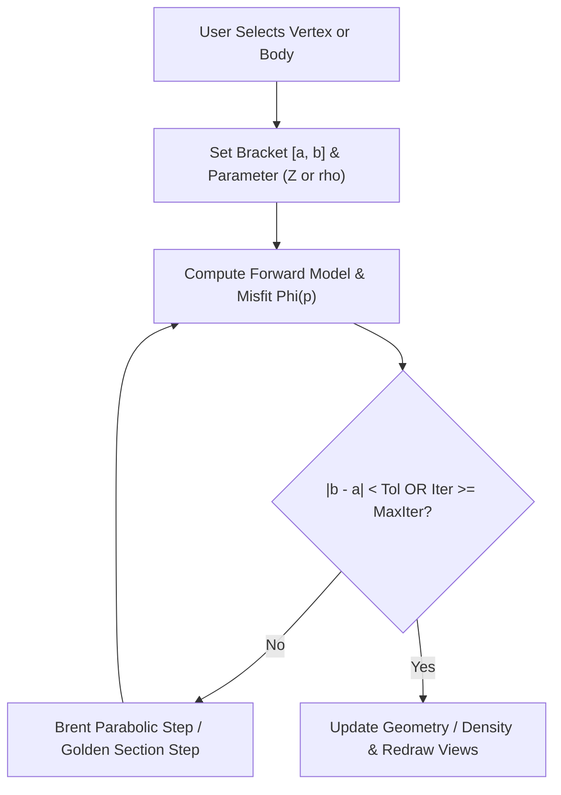

# Mod3D System Specification
## Complete Architectural, Physical, Mathematical, and Functional Specification

---

## 1. Document Overview & System Purpose

### 1.1 Mission & Vision
**Mod3D** is a high-performance, cross-platform software system for interactive 2.5D and 3D forward modeling and inversion of potential fields (gravity, gravity gradients, and magnetics). It allows geoscientists to construct, reshape, and refine complex subsurface geological models in real time, with immediate visual feedback of modeled potential field anomalies compared against observed geophysical surveys.

```
+----------------------------------------------------------------------------------------------------+
|                                      MOD3D SYSTEM LANDSCAPE                                        |
+----------------------------------------------------------------------------------------------------+
|                                                                                                    |
|    +------------------------+      +--------------------------+      +------------------------+    |
|    |      Map View          | <==> |       Profile View       | <==> |       3D GL View       |    |
|    | (2D Survey & Contours) |      | (Interactive Geological) |      | (Perspective & Direct) |    |
|    +------------------------+      +--------------------------+      +------------------------+    |
|                 ^                               ^                                 ^                |
|                 |                               |                                 |                |
|                 v                               v                                 v                |
|    +------------------------------------------------------------------------------------------+    |
|    |                      ModelDocument / ModelController (Qt 6 Adapter)                      |    |
|    +------------------------------------------------------------------------------------------+    |
|                                                 |                                                  |
|                   +-----------------------------+-----------------------------+                    |
|                   v                                                           v                    |
|    +------------------------------+                           +-------------------------------+    |
|    |      mod3d::Model (Core)     |                           |   mod3d::Observation (Core)   |    |
|    |  - Discretized 3D Polyhedra  |                           |  - Multi-component Grids      |    |
|    |  - Bodies & ColumnPoints     |                           |  - Measured & Modeled Fields  |    |
|    |  - Topological Invariants    |                           |  - Difference & Misfit RMS    |    |
|    +------------------------------+                           +-------------------------------+    |
|                   ^                                                           ^                    |
|                   |                      +--------------------+               |                    |
|                   +--------------------> | mod3d::Inversion1D | <-------------+                    |
|                                          | - Automated Fit    |                                    |
|                                          +--------------------+                                    |
|                                                 ^                                                  |
|                                                 |                                                  |
|                                  +-----------------------------------------------+             |
|                                  |   mod3d::pfld / PotField (Physics Engine)     |             |
|                                  |  - Vladimír Pohánka Analytical Kernel (Primary)             |
|                                  |  - Guptasarma-Singh & Götze-Petersen Kernels  |             |
|                                  |  - Gravity, Tensor Gradients, Magnetics       |             |
|                                  +-----------------------------------------------+             |
|                                                                                                    |
+----------------------------------------------------------------------------------------------------+
```

### 1.2 Core Architectural Principles
1. **Interactive Real-Time Modeling**: Subsurface geometry changes made with mouse gestures produce instantaneous updates ($\le 16\text{ ms}$, 60 FPS) to modeled field curves and anomaly maps via local facet difference caching.
2. **Rigorous Topological Consistency**: The subsurface is discretized into regular vertical grid columns containing polyhedral bodies. The engine strictly prevents non-physical self-intersections, overlaps, or boundary inversions.
3. **Decoupled Architecture**: 
   - `mod3d_core`: Pure standard C++20 computational library with zero dependencies on GUI, windowing, or OpenGL.
   - `mod3d_gui`: Modern Qt 6 application utilizing hardware-accelerated rendering (`QPainter` and `QOpenGLWidget`), reproducing 100% of the legacy workflow and controls.
4. **Cross-Platform Parity**: Full native performance on macOS (Apple Silicon / Intel), Linux, and Windows.

---

## 2. Mathematical & Physical Foundations

### 2.1 Coordinate Reference Frames

#### Cartesian System
Mod3D employs a right-handed Cartesian coordinate system:
- **$X$-axis**: Easting, pointing East ($+X$).
- **$Y$-axis**: Northing, pointing North ($+Y$).
- **$Z$-axis**: Vertical elevation, pointing **Upward** ($+Z$). Depth is represented as negative elevation ($Z < 0$).

#### Spherical Earth Transformation
For regional or continental-scale models ($> 100\text{ km}$), Mod3D provides spherical Earth curvature corrections:
- Cartesian coordinates $(X, Y, Z)$ are mapped to a spherical shell of radius $R = R_{Earth} + Z$, where $R_{Earth} \approx 6,371,000\text{ m}$.
- Normal gravity vector and gravity gradient directions are adjusted relative to the local radial normal.

---

### 2.2 Gravitational Potential, Acceleration & Marussi Tensor

Let $V$ denote a 3D polyhedral domain with mass density distribution $\rho(\mathbf{r}')$. The gravitational potential $U$ at an observation point $P(\mathbf{r})$ is:
$$U(\mathbf{r}) = G \iiint_V \frac{\rho(\mathbf{r}')}{|\mathbf{r} - \mathbf{r}'|} \, d^3\mathbf{r}'$$
where $G = 6.67430 \times 10^{-11} \, \text{m}^3 \text{kg}^{-1} \text{s}^{-2}$.

#### Gravitational Acceleration Vector
The gravitational acceleration vector $\mathbf{g} = (g_x, g_y, g_z)$ is the gradient of the potential:
$$\mathbf{g}(\mathbf{r}) = \nabla U(\mathbf{r}) = G \iiint_V \rho(\mathbf{r}') \frac{\mathbf{r}' - \mathbf{r}}{|\mathbf{r}' - \mathbf{r}|^3} \, d^3\mathbf{r}'$$
In geophysical exploration, the vertical component $g_z$ is the standard Bouguer/free-air gravity anomaly (conventionally positive downward or upward depending on survey setup; Mod3D tracks $+Z$ upward, so anomaly attractive force toward depth has $g_z < 0$ or displayed as positive anomaly via configurable polarity).

#### Gravity Gradient Tensor (Marussi Tensor)
The second derivatives of the gravitational potential define the symmetric, trace-free Marussi tensor $\mathbf{T}$:
$$T_{ij}(\mathbf{r}) = \frac{\partial^2 U}{\partial x_i \partial x_j} = G \iiint_V \rho(\mathbf{r}') \left( \frac{3(x'_i - x_i)(x'_j - x_j)}{|\mathbf{r}' - \mathbf{r}|^5} - \frac{\delta_{ij}}{|\mathbf{r}' - \mathbf{r}|^3} \right) \, d^3\mathbf{r}'$$
where $i, j \in \{x, y, z\}$. Outside the source mass, Laplace's equation holds:
$$\nabla^2 U = \text{Tr}(\mathbf{T}) = T_{xx} + T_{yy} + T_{zz} = 0$$
The 6 independent tensor components evaluated by Mod3D are:
$$\mathbf{T} = \begin{bmatrix} T_{xx} & T_{xy} & T_{xz} \\ T_{xy} & T_{yy} & T_{yz} \\ T_{xz} & T_{yz} & T_{zz} \end{bmatrix}$$
Units: Eötvös ($1\text{ E} = 10^{-9}\text{ s}^{-2} = 0.1\text{ mGal/km}$).

---

### 2.3 Magnetic Potential & Total Field Anomaly

Let $V$ possess a total magnetization vector $\mathbf{M}(\mathbf{r}')$. The magnetic scalar potential $W$ at $\mathbf{r}$ is:
$$W(\mathbf{r}) = -\frac{\mu_0}{4\pi} \iiint_V \mathbf{M}(\mathbf{r}') \cdot \nabla \left( \frac{1}{|\mathbf{r} - \mathbf{r}'|} \right) \, d^3\mathbf{r}'$$
where $\mu_0 = 4\pi \times 10^{-7}\text{ H/m}$.

#### Magnetic Anomaly Vector
The anomalous magnetic flux density $\mathbf{B} = (B_x, B_y, B_z)$ is:
$$\mathbf{B}(\mathbf{r}) = -\mu_0 \nabla W(\mathbf{r})$$

#### Total Field Anomaly ($\Delta T$)
Under the standard geomagnetic approximation (where $|\mathbf{B}| \ll |\mathbf{T}_0|$), the total magnetic anomaly $\Delta T$ is the projection of $\mathbf{B}$ onto the regional inducing geomagnetic field unit vector $\hat{\mathbf{t}}_0$:
$$\Delta T(\mathbf{r}) \approx \mathbf{B}(\mathbf{r}) \cdot \hat{\mathbf{t}}_0$$
where $\hat{\mathbf{t}}_0 = (\cos I_0 \cos D_0, \, \cos I_0 \sin D_0, \, \sin I_0)$, with $I_0$ = geomagnetic inclination, $D_0$ = geomagnetic declination.

#### Total Magnetization Vector
$$\mathbf{M} = \mathbf{M}_{ind} + \mathbf{M}_{rem} = \kappa \frac{\mathbf{T}_0}{\mu_0} + \mathbf{M}_{rem}$$
- $\kappa$: Magnetic susceptibility (dimensionless SI).
- $\mathbf{T}_0$: Inducing field magnitude $T_0$ [nT], inclination $I_0$ [deg], declination $D_0$ [deg].
- $\mathbf{M}_{rem}$: Remanent magnetization magnitude $J_{rem}$ [A/m or nT equivalent], inclination $I_{rem}$ [deg], declination $D_{rem}$ [deg].

---

### 2.4 Density Models & Inhomogeneous Media

Mod3D supports two density formulations:
1. **Homogeneous Density**: Constant density contrast $\Delta \rho = \rho_{body} - \rho_{ref}$.
2. **3D Linear Density Gradient**:
   $$\rho(P) = \rho_{body} + \mathbf{g}_{dens} \cdot (\mathbf{r}_P - \mathbf{r}_0)$$
   where:
   - $\rho_{body}$: Base body density [kg/m$^3$] at reference origin $\mathbf{r}_0 = (X_0, Y_0, Z_0)$.
   - $\mathbf{g}_{dens} = (g_x, g_y, g_z)$: 3D density gradient vector [kg/m$^4$].
   - For compaction increasing with depth: $g_z < 0$.
   - Effective computational density: $\rho_{comp}(P) = \rho(P) - \rho_{ref}(P)$.

---

### 2.5 Primary Gravity Field Computation: The Vladimír Pohánka Analytical Method

The primary and default gravity computation engine in Mod3D (`Formula::POHANKA = 0`, as initialized in `Mod3DDoc`) is based on the optimum analytical formulation developed by **Dr. Vladimír Pohánka**:

> [!NOTE]
> **Foundational Publications**:
> 1. **Pohánka, V. (1988)**: *Optimum expression for computation of the gravity field of a polyhedron.* Geophysics, Vol. 53, No. 11, pp. 1457–1467.
> 2. **Pohánka, V. (1998)**: *Calculation of the gravity field of a body with arbitrary shape and inhomogeneous density.* Contributions to Geophysics and Geodesy, Vol. 28, No. 3, pp. 169–188.

#### Why Pohánka's Method is the Primary Choice
1. **Mathematical Optimality**: Expresses the gravitational attraction and tensor gradients of arbitrary planar polygonal and triangular facets using a minimal, non-redundant set of logarithmic and arctangent boundary functions.
2. **Singularity-Free Formulation**: The logarithmic and arctangent arguments are conditioned to remain entirely well-behaved without numerical degradation when the observation point $P$ approaches, touches, or lies upon facet vertices, edges, or the facet plane itself ($z \to 0$).
3. **Exact Linear Density Gradient Support**: Provides exact, closed-form analytical solutions not only for homogeneous density contrasts, but also for continuous 3D linear density gradients $\rho(P) = \rho_0 + \mathbf{g}_{dens} \cdot (\mathbf{r}_P - \mathbf{r}_0)$, essential for modeling sedimentary compaction and regional crustal gradients.

#### Analytical Formulation on Planar Facets
For a planar facet with $n$ vertices $\mathbf{p}_0, \mathbf{p}_1, \dots, \mathbf{p}_{n-1}$ (in Mod3D, $n=3$ for triangular facets) and unit outward normal $\mathbf{n}$:

1. **Local Edge Coordinate System**:
   For each directed edge $i$ connecting vertex $\mathbf{p}_i$ to $\mathbf{p}_{i+1}$ (with cyclic index $\mathbf{p}_n = \mathbf{p}_0$):
   - Edge length: $d_i = |\mathbf{p}_{i+1} - \mathbf{p}_i|$
   - Edge unit vector: $\mathbf{u}_i = \frac{\mathbf{p}_{i+1} - \mathbf{p}_i}{d_i}$
   - In-plane outward unit normal perpendicular to edge: $\mathbf{n}_i = \mathbf{u}_i \times \mathbf{n}$

2. **Observation Point Projection**:
   For an observation station $\mathbf{r}$:
   - Signed normal distance to facet plane: $Z = \mathbf{n} \cdot (\mathbf{p}_0 - \mathbf{r})$
   - Absolute perpendicular distance: $z = |Z| + \varepsilon$ (with $\varepsilon \approx 10^{-12}$ to handle plane singularities)
   - Plane sign: $e = \text{sgn}(Z)$

3. **Per-Edge Coordinates**:
   - $u_i = \mathbf{u}_i \cdot (\mathbf{p}_i - \mathbf{r})$
   - $v_i = u_i + d_i = \mathbf{u}_i \cdot (\mathbf{p}_{i+1} - \mathbf{r})$
   - $w_i = \mathbf{n}_i \cdot (\mathbf{p}_i - \mathbf{r})$
   - Radial terms: $W_i^2 = w_i^2 + z^2, \quad W_i = \sqrt{W_i^2}$
   - Hypotenuse distances: $U_i = \sqrt{u_i^2 + W_i^2}, \quad V_i = \sqrt{v_i^2 + W_i^2}, \quad T_i = U_i + V_i$

4. **Optimum Boundary Functions (Pohánka 1988)**:
   - **Logarithmic Edge Function ($L_i$)**:
     $$L_i = \begin{cases} \text{sgn}(v_i) \ln \left( \frac{V_i + |v_i|}{U_i + |u_i|} \right) & \text{if } \text{sgn}(u_i) = \text{sgn}(v_i) \\ \ln \left( \frac{(V_i + |v_i|)(U_i + |u_i|)}{W_i^2} \right) & \text{if } \text{sgn}(u_i) \ne \text{sgn}(v_i) \end{cases}$$
   - **Angular Arctangent Function ($A_i$)**:
     $$A_i = -\arctan \left( \frac{2 w_i d_i}{(T_i + d_i)|T_i - d_i| + 2 T_i z} \right)$$
   - **Solid Angle Potential Terms**:
     $$\Phi_i = w_i L_i + 2 z A_i$$
     $$\Phi_{2, i} = \frac{d_i}{4} \left( \frac{(v_i + u_i)^2}{T_i} + T_i \right) + \frac{W_i^2 L_i}{2}$$

5. **Field Accumulation**:
   - **Constant Density Gravity Vector**:
     $$\mathbf{g} = G (\rho - \rho_{ref}) \sum_{faces} \mathbf{n} \left( \sum_{i=1}^n \Phi_i \right)$$
   - **Linear Density Gradient Gravity Vector**:
     $$\mathbf{g} = G \sum_{faces} \sum_{i=1}^n \left[ \mathbf{n} \left( \Phi_i (\rho_0 + \mathbf{g}_{dens} \cdot \mathbf{r} + (\mathbf{g}_{dens} \cdot \mathbf{n}) Z) + (\mathbf{g}_{dens} \cdot \mathbf{n}_i) \Phi_{2, i} \right) - \mathbf{g}_{dens} \left( \frac{\Phi_i Z}{2} \right) \right]$$
   - **Marussi Gravity Gradient Tensor ($\mathbf{T}$)**:
     Using the tensor edge vector $\mathbf{t}_i = \mathbf{n}_i L_i + 2 e A_i \mathbf{n}$:
     $$T_{xx} = G \Delta \rho \sum t_{x} n_x, \quad T_{yy} = G \Delta \rho \sum t_{y} n_y, \quad T_{zz} = G \Delta \rho \sum t_{z} n_z$$
     $$T_{xy} = \frac{1}{2} G \Delta \rho \sum (t_x n_y + t_y n_x), \quad T_{xz} = \frac{1}{2} G \Delta \rho \sum (t_x n_z + t_z n_x), \quad T_{yz} = \frac{1}{2} G \Delta \rho \sum (t_y n_z + t_z n_y)$$

---

### 2.6 Secondary & Validation Potential Field Kernels

In addition to Vladimír Pohánka's primary formulation, Mod3D integrates complementary potential field engines:
1. **Guptasarma & Singh (1999)** (`Formula::GUPTASARMA_SINGH = 1`):
   - Computes coupled magnetic and gravitational anomalies over planar polygonal facets using solid angle integration and analytical edge projections. Used for rapid magnetic anomaly evaluations and cross-method verification.
2. **Götze & Petersen (1992)** (`pfld/g3d_poly.c`, `pfld/m3d_poly.c`):
   - Classical polyhedral line-integral formulation transforming boundary integrals into closed contour edge sums, maintained as a reference validation baseline.

---

## 3. Geological Model Architecture & Data Structures

### 3.1 Discretized Column-Based Polyhedral Model

```
+----------------------------------------------------------------------------------------------------+
| 3D DISCRETIZED COLUMN-BASED GEOLOGICAL TOPOLOGY                                                    |
+----------------------------------------------------------------------------------------------------+
|                                                                                                    |
|   Profile j-1                     Profile j (Active)              Profile j+1                      |
|                                                                                                    |
|        |                               |                               |                           |
|      --+-------------------------------+-------------------------------+--   Relief Surface (DEM)  |
|        |           v1                  |           v2                  |                           |
|        |          / \                  |          / \                  |                           |
|        |         /   \                 |         /   \                 |                           |
|        |        /     \                |        /     \                |                           |
|        |       *-------*               |       *-------*               |     Body A (Upper Unit)   |
|        |       |       |               |       |       |               |                           |
|        |       | Body A|               |       | Body A|               |                           |
|        |       *-------* [Shared Bnd]  |       *-------* [Shared Bnd]  |                           |
|        |       |       |               |       |       |               |     Body B (Lower Unit)   |
|        |       | Body B|               |       | Body B|               |                           |
|        |       *-------*               |       *-------*               |                           |
|        |                               |                               |                           |
|      --+-------------------------------+-------------------------------+--   Model Bottom (Zmin)   |
|        |                               |                               |                           |
|      Col i-1                         Col i                           Col i+1                       |
|                                                                                                    |
+----------------------------------------------------------------------------------------------------+
```

The 3D subsurface volume is structured over a regular 2D horizontal mesh of columns:
- Grid points: $(X_i, Y_j)$ where $i \in [0, N_x-1]$, $j \in [0, N_y-1]$.
- Top boundary: Continuous DEM relief mesh $Z_{relief}(X_i, Y_j)$.
- Bottom boundary: Planar base depth $Z_{min}$ ("hell").
- Set of profiles: Vertical slices oriented East-West (constant $Y$) or South-North (constant $X$).

### 3.2 Core Model Entities

#### `mod3d::ColumnPoint`
A lightweight, value-type representation of a body's boundary at a specific column $(i, j)$:
```cpp
class ColumnPoint {
    Point2D pt_;       // Column coordinates (X, Y)
    double  z_;        // Depth / Elevation (Z)
    int     body_id_;  // Associated Body ID
    bool    modified_; // Dirty flag for facet delta updates
};
```
Within each column, a body is defined by:
- An **Upper Boundary Point** ($Z_{top}$).
- A **Lower Boundary Point** ($Z_{bot}$).

#### `mod3d::Body`
A distinct geological unit (e.g., formation, intrusion, salt dome):
- **Physical Properties**: Base density $\rho$, 3D density gradient $\mathbf{g}_{dens}$, magnetic susceptibility $\kappa$, remanence vector $\mathbf{M}_{rem}$.
- **Topological Data**: Collection of column point pairs indexed by $(i, j)$.
- **Display Attributes**: Line styles, hatch brush, fill color, 3D alpha transparency $\alpha \in [0.0, 1.0]$, wireframe/solid toggle.
- **State Flags**: `active` (included in potential field computation), `locked` (protected against mouse dragging).

#### `mod3d::Facet3Pt`
A planar triangular boundary facet connecting three 3D vertices:
$$\mathbf{v}_1 = (X_1, Y_1, Z_1), \quad \mathbf{v}_2 = (X_2, Y_2, Z_2), \quad \mathbf{v}_3 = (X_3, Y_3, Z_3)$$
Equipped with outward normal $\hat{\mathbf{n}}$ and area $A$. Facets are dynamically generated between adjacent columns $(i, j) \leftrightarrow (i+1, j)$ and adjacent profiles $j \leftrightarrow j+1$.

---

### 3.3 Topological Invariants & Integrity Constraints

The model engine strictly enforces the following invariants at all times:
1. **Vertical Bounds**:
   $$\forall (i, j, b): \quad Z_{min} \le Z_{bot}(i, j, b) \le Z_{top}(i, j, b) \le Z_{relief}(i, j)$$
2. **Body Integrity**: For any body $b$, the upper boundary cannot cross beneath the lower boundary:
   $$Z_{top}(i, j, b) \ge Z_{bot}(i, j, b)$$
3. **Pinch-Out Wedges**: If $Z_{top}(i, j, b) = Z_{bot}(i, j, b)$, the body tapers to zero thickness at that column, forming an exact geological pinch-out wedge.
4. **Stratigraphic Order & Non-Overlap**: For two distinct bodies $A$ and $B$ where $A$ lies stratigraphically above $B$:
   $$Z_{bot}(i, j, A) \ge Z_{top}(i, j, B)$$
   Bodies cannot intersect or invade one another.
5. **Shared Boundaries**: When adjacent bodies touch ($Z_{bot}(A) = Z_{top}(B)$), their vertices are topologically fused. Moving the shared vertex simultaneously deforms both bodies without creating voids or artificial overlaps.

---

### 3.4 Real-Time Facet Delta Caching

To achieve smooth 60 FPS performance during interactive mouse dragging:
1. When a vertex at column $(i_0, j_0)$ is displaced to $Z'$, only facets $\mathcal{F}_{local}$ incident to column $(i_0, j_0)$ are deformed.
2. The system computes the field difference:
   $$\Delta \mathbf{F}(\mathbf{r}_k) = \sum_{f \in \mathcal{F}_{new}} \mathbf{F}_f(\mathbf{r}_k) - \sum_{f \in \mathcal{F}_{old}} \mathbf{F}_f(\mathbf{r}_k)$$
3. Modeled observation grids are updated via direct addition:
   $$\mathbf{F}_{modeled}(\mathbf{r}_k) \leftarrow \mathbf{F}_{modeled}(\mathbf{r}_k) + \Delta \mathbf{F}(\mathbf{r}_k)$$
4. This localized $\mathcal{O}(N_{local})$ update eliminates the need for full $\mathcal{O}(N_{total})$ recomputations during user interaction.

---

## 4. Observation Space & Inversion Engine

### 4.1 Observation Mesh & Grids

The observation space is represented by regular 2D matrices ($N_x \times N_y$):
- **Spatial Coordinates**: $X_{min}, X_{max}, \Delta X$, $Y_{min}, Y_{max}, \Delta Y$, and elevation $Z_{obs}(x, y)$.
- **Flight Elevation Modes**:
  - *Constant Elevation*: $Z_{obs}(x, y) = H_{const}$ (e.g., airborne survey).
  - *Drape Elevation*: $Z_{obs}(x, y) = Z_{relief}(x, y) + H_{sensor}$ (ground or draped survey).

#### Supported Field Components (14 Channels)
| Channel | Category | Description | Unit |
| :--- | :--- | :--- | :--- |
| **$G_x$** | Gravity | East-West horizontal gravitational acceleration | mGal |
| **$G_y$** | Gravity | North-South horizontal gravitational acceleration | mGal |
| **$G_z$** | Gravity | Vertical gravitational acceleration | mGal |
| **$G_{tot}$** | Gravity | Total gravitational acceleration magnitude | mGal |
| **$M_x$** | Magnetics | East-West anomalous magnetic flux density | nT |
| **$M_y$** | Magnetics | North-South anomalous magnetic flux density | nT |
| **$M_z$** | Magnetics | Vertical anomalous magnetic flux density | nT |
| **$M_{tot}$** | Magnetics | Total magnetic intensity anomaly ($\Delta T$) | nT |
| **$T_{xx}$** | Tensor | Second derivative $\partial^2 U / \partial x^2$ | Eötvös |
| **$T_{yy}$** | Tensor | Second derivative $\partial^2 U / \partial y^2$ | Eötvös |
| **$T_{zz}$** | Tensor | Second derivative $\partial^2 U / \partial z^2$ | Eötvös |
| **$T_{xy}$** | Tensor | Cross derivative $\partial^2 U / \partial x \partial y$ | Eötvös |
| **$T_{xz}$** | Tensor | Cross derivative $\partial^2 U / \partial x \partial z$ | Eötvös |
| **$T_{yz}$** | Tensor | Cross derivative $\partial^2 U / \partial y \partial z$ | Eötvös |

Each component tracks:
- **Measured Grid** ($\mathbf{F}_{mes}$)
- **Modeled Grid** ($\mathbf{F}_{mod}$)
- **Difference Grid** ($\Delta \mathbf{F} = \mathbf{F}_{mes} - \mathbf{F}_{mod}$)

---

### 4.2 Statistical Misfit Indicators

1. **Root-Mean-Square Error (RMS)**:
   $$\text{RMS} = \sqrt{\frac{1}{N} \sum_{k=1}^N \left( F_{mes}(k) - F_{mod}(k) \right)^2}$$
2. **Derivative Trend Indicator (DRV)**:
   A pseudo-derivative measuring high-frequency spatial misfit roughness:
   $$\text{DRV} = \frac{1}{N} \sum_{i, j} \left( \left| \frac{\Delta F_{i+1, j} - \Delta F_{i, j}}{\Delta x} \right| + \left| \frac{\Delta F_{i, j+1} - \Delta F_{i, j}}{\Delta y} \right| \right)$$

---

### 4.3 Automated 1D Inversion / Fitting Engine

Mod3D incorporates an automated 1D optimization engine for rapid structural and property tuning:



#### Parameter Modes
1. **Vertex Depth Fitting**: Optimizes the vertical elevation $Z_{k}$ of an individual body vertex along its column line.
2. **Body Density Fitting**: Optimizes the homogeneous density $\rho_b$ of an entire body.

#### Optimization Algorithms
- **Brent's Method**: Combines golden section search with parabolic inverse interpolation for superlinear convergence near minima.
- **Golden Section Search**: Robust, derivative-free interval reduction.

#### Objective Functions ($\Phi$)
- **Global RMS**: Minimizes the survey-wide root-mean-square anomaly error.
- **Global Derivative**: Minimizes spatial error gradients across the difference grid.
- **Local Derivative**: Minimizes error curvature specifically at stations directly above the modified column.

---

## 5. Ancillary Geological Entities

### 5.1 Boreholes & Multi-Channel Well Logs
- **Trajectory Representation**: 3D polyline with measured depth $MD$, true vertical depth $TVD$, Easting $X$, Northing $Y$.
- **Wireline Logs**: Multi-channel curve data (gamma ray, density, sonic, resistivity).
- **Lithology Columns**: Discrete stratigraphic intervals with color classifications.
- **Projection to Cross-Section**:
  - Projected onto Profile View if the perpendicular distance $d_\perp \le R_{display}$.
  - Plotted as log curves ribbon with configurable horizontal radius and alignment (Left, Center, Right).
- **3D Visualization**: Solid or wireframe cylinders with depth-dependent lithological bands.

### 5.2 Structural Guidelines & Fault Traces
- Imported vector polylines representing seismic reflectors, fault planes, or horizon tops.
- Rendered in Profile View as guideline arrows, text callouts, and customizable pen traces.

### 5.3 Georeferenced Imagery & Basemaps
- Registered 2D bitmaps (satellite photography, topographic maps, scanned seismic sections).
- Support for affine transformations: $[X_{min}, X_{max}] \times [Y_{min}, Y_{max}]$.
- Rendered transparently in Map View and Profile View.

---

## 6. User Interface & Interaction Specification

### 6.1 MDI Workspace Architecture
The GUI is built upon a standard Qt 6 Multi-Document Interface (`QMdiArea`):
- Multiple documents can be open simultaneously.
- Each document can spawn an arbitrary number of synchronized views:
  - **Profile Views**: Multiple cross-sections across different rows/columns.
  - **Map Views**: Regional and local zoom levels.
  - **3D Views**: Perspectives from different azimuths/elevations.
  - **Spreadsheet Views**: Numerical tabular inspection.

---

### 6.2 The 4 Primary Synchronized Views

#### 1. Profile View (`ProfileView`)
The centerpiece modeling canvas:
- **Upper Canvas**: Potential field profiles (Modeled: solid, Measured: crosses, Difference: dashed) with interactive field scale axis and RMS/DRV indicator badges.
- **Lower Canvas**: Geological cross-section showing DEM topography, bottom boundary, polyhedral bodies, and ghost outlines of bodies from adjacent profiles.
- **Interactive Splitter**: Resizes the proportion between field curves and geological section.

#### 2. Map View (`MapView`)
Plan-view geophysical workstation:
- Multi-layer rendering: DEM raster, marching squares isolines, station points, body footprints, wells, guidelines.
- **Active Profile Crosshair**: Visualizes current profile line; dragging the line dynamically updates the Profile View.

#### 3. 3D OpenGL View (`GL3DView`)
Interactive 3D spatial canvas:
- **Rendering Mode**: Trackball orbit, pan, smooth zoom, preset views (`E`, `W`, `N`, `S`, `M`).
- **Selection Mode**: Interactive 3D vertex picking; clicking a vertex and dragging vertically moves the subsurface boundary in 3D with live field updates.
- Alpha transparency $\alpha \in [0, 1]$ for subsurface visibility.

#### 4. Spreadsheet View (`SpreadsheetView`)
- Table representation of numerical grid data, coordinates, and computed anomalies.
- Full clipboard copy/paste support for spreadsheet applications.

---

### 6.3 Interactive Mouse Gestures & Hit-Testing

```
+----------------------------------------------------------------------------------------------------+
| INTERACTIVE GESTURE MATRIX                                                                         |
+----------------------+--------------------------+--------------------------------------------------+
| Gesture              | State / Modifier         | Action & Geological Rule                         |
+----------------------+--------------------------+--------------------------------------------------+
| Vertical Drag        | Over Vertex (cursor_v)   | Moves vertex vertically along column. Clamped to |
|                      |                          | relief, bottom, and neighboring bodies.          |
+----------------------+--------------------------+--------------------------------------------------+
| Side Extension       | Over Body Edge (cursor_e)| Outward drag creates new slice on neighbor col.  |
|                      |                          | Inward drag collapses edge. Merges same body.    |
+----------------------+--------------------------+--------------------------------------------------+
| Freehand Sculpting   | Drag across columns      | Vertices snap to mouse height as cursor crosses  |
|                      |                          | column grid lines.                               |
+----------------------+--------------------------+--------------------------------------------------+
| Boundary Snapping    | Drag vertex to neighbor  | Merges vertices into a permanent common boundary.|
+----------------------+--------------------------+--------------------------------------------------+
| Boundary Disconnect  | Ctrl + Drag shared vertex| Splices shared vertex into independent vertices. |
+----------------------+--------------------------+--------------------------------------------------+
| Body Translation     | Shift + Drag body        | Translates entire body vertically as rigid unit. |
+----------------------+--------------------------+--------------------------------------------------+
| Profile Step         | N / P or Arrow keys      | Steps to Next / Previous profile slice.          |
+----------------------+--------------------------+--------------------------------------------------+
| Orientation Switch   | H / V                    | Switches between East-West and South-North slices|
+----------------------+--------------------------+--------------------------------------------------+
| Body Profile Copy    | Ctrl+Shift+N / P         | Duplicates body geometry to adjacent profile.    |
+----------------------+--------------------------+--------------------------------------------------+
```

---

### 6.4 Comprehensive Dialog Inventory (All 38 Dialogs)

The GUI encompasses 38 dedicated dialogs and property sheets:
1. `ModelPropertiesDialog` (`IDD_DLG_MODEL`): Global model bounds, lateral extensions, and motion constraints.
2. `DefineObservationDialog` (`IDD_DLG_MODEL_DEF_OBS`): Regular survey mesh generation ($X, Y, \Delta X, \Delta Y$).
3. `ObservationsDialog` (`IDD_DLG_OBSERVATIONS`): Observation station and grid dataset management.
4. `VerticalRangeDialog` (`IDD_DLG_MODEL_RANGE_Z`): Model base depth ($Z_{min}$) and vertical exaggeration.
5. `BodyGravityPage` (`IDD_DLG_BODY_GRAV`): Density contrast and 3D linear density gradient vector.
6. `BodyMagneticsPage` (`IDD_DLG_BODY_MAG`): Susceptibility, remanent intensity, inclination, declination.
7. `BodyDrawPage` (`IDD_DLG_BODY_DRAW`): Pens, brushes, 3D alpha transparency, wireframe/solid toggle.
8. `BodyComputationPage` (`IDD_DLG_BODY_COMPUTATION`): Computation active flag and geometry lock.
9. `BodyDescriptionPage` (`IDD_DLG_BODY_DESCRIPTION`): ID, geological unit name, stratigraphy notes.
10. `BodyCreationDialog` (`IDD_DLG_BODY_CREATION`): Lateral extension defaults and thickness scaling ratio.
11. `BodyMoveDialog` (`IDD_DLG_BODY_MOVE`): Numerical 3D translation offsets $(\Delta X, \Delta Y, \Delta Z)$.
12. `EditBodiesDialog` (`IDD_DLG_MODEL_EDIT_BODIES`): Body hierarchy list, reordering, visibility, deletion.
13. `InsertExistingBodyDialog` (`IDD_DLG_MODEL_INSERT_EXISTING_BODY`): Body segment instantiator.
14. `ComputeCompPage` (`IDD_DLG_COMPUTE_COMP`): Real-time modes (`None`, `Real-time`, `After Release`), spherical Earth.
15. `ComputeGravPage` (`IDD_DLG_COMPUTE_GRAV`): Sensor elevation, units, reference reduction density.
16. `ComputeMagPage` (`IDD_DLG_COMPUTE_MAG`): Sensor elevation, inducing geomagnetic field vector.
17. `InducingFieldDialog` (`IDD_DLG_MODEL_INDUCING_FIELD`): Geomagnetic field parameters ($T_0, I_0, D_0$).
18. `ActiveGridsDialog` (`IDD_DLG_MODEL_GRD_ACTIVE`): Matrix of active potential field components.
19. `FieldIndicatorDialog` (`IDD_DLG_MODEL_FLD_INDICATOR`): RMS and DRV error display configuration.
20. `Fit1DDialog` (`IDD_DLG_FIT_1D`): 1D Brent/Golden-section automated inversion settings.
21. `MapViewPropertiesDialog` (`IDD_DLG_VIEW_MAP`): Raster quality slider, layer visibility toggles.
22. `View3DSettingsPage` (`IDD_DLG_3DVIEW_SETTINGS`): Rendering mode vs Selection mode, step increments.
23. `View3DModelPage` (`IDD_DLG_3DVIEW_MODEL`): 3D lighting, shading, and mesh presentation.
24. `View3DFieldPage` (`IDD_DLG_3DVIEW_FIELD`): Draped 3D potential field color isosurfaces.
25. `View3DAxesPage` (`IDD_DLG_3DVIEW_AXES`): 3D bounding coordinate box and dimension labels.
26. `View3DCameraDialog` (`IDD_DLG_3DVIEW_SAVE_LOAD`): Viewpoint bookmarking and restoration.
27. `WellPropertiesDialog` (`IDD_DLG_WELL`): Borehole log curves, lithology colors, projection radii.
28. `GuidelinePropertiesDialog` (`IDD_DLG_MODEL_GUIDELINE`): Geological structural vector traces and labels.
29. `ObjectManagerDialog` (`IDD_OBJECT_MANAGER`): Hierarchical tree of workspace entities.
30. `ColorGradientDialog` (`IDD_COLOR_GRAD`): Multi-stop continuous and discrete color palettes.
31. `PenCustomizerDialog` (`IDD_DLG_PEN`): Line style, thickness, and color editor.
32. `AxisPropertiesDialog` (`IDD_DLG_AXIS`): Axis tick marks, numbering, fonts, and ranges.
33. `ProfileSettingsDialog` (`IDD_DLG_PROFILE_SETTINGS`): Profile display options and ghost overlays.
34. `ImportPictureDialog` (`IDD_DLG_MODEL_IMPORT_PICTURE`): Georeferenced bitmap image registration.
35. `BodyImportDialog` (`IDD_DLG_MODEL_BODY_IMPORT`): External body geometry importer.
36. `BodyExportDialog` (`IDD_DLG_BODY_EXPORT`): Body geometry exporter.
37. `FieldImportExportDialog` (`IDD_DLG_FIELD_IMPEXP`): Matrix format selector for field exchange.
38. `AboutDialog` (`IDD_DLG_ABOUT`): Version, build info, credits, and scientific licensing.

---

## 7. File Formats & Data Interoperability

### 7.1 Native Mod3D Project File (`.m3d`)
The native project file stores the entire geophysical workspace:
- **Header**: Version identifier, project title, bounding box ($X_{min}, X_{max}, Y_{min}, Y_{max}, Z_{min}, Z_{max}$), coordinate system metadata.
- **Observation Space**: Regular station grid dimensions, elevation mesh, measured potential field grids.
- **Geological Model**: Body catalog, physical properties (density, susceptibility, remanence), topological column point sets.
- **Ancillary Data**: Borehole trajectories and logs, guideline vectors, registered basemaps.
- **Workspace State**: Open views, active profile index, camera viewpoints, color ramps.

### 7.2 Standard Import / Export Formats
- **Surfer ASCII Grid (`.grd`)**: Standard Golden Software ASCII raster format (`DSAA`).
- **Geosoft Grid / XYZ**: Multi-column ASCII survey station data ($X, Y, Z, \text{val}_1, \dots$).
- **Guideline Vector Format (`.dat`)**:
  ```text
  line Fault_A
  10500.0  4200.0  350.0
  11200.0  4300.0  -200.0
  11800.0  4400.0  -850.0
  line Unconformity_1
  ...
  ```
- **Well Data (LAS 2.0 / ASCII)**: Multi-channel log data with header parameters, depth track, and curve channels.

---

## 8. Software Architecture & Implementation Quality Standards

### 8.1 Module Hierarchy & Ownership

```
Mod3D/
├── include/mod3d/               # Public C++20 Core API (Headless, Zero Qt)
│   ├── Model.h                  # Top-level geological model container
│   ├── Body.h                   # Geological unit and physical properties
│   ├── ColumnPoint.h            # Column boundary point
│   ├── Facet3Pt.h               # Triangular facet geometry & Pohánka analytical kernel
│   ├── PotField.h               # Potential field kernels (Pohánka, Guptasarma-Singh)
│   ├── Grid.h                   # 2D regular matrix and interpolation
│   ├── Observation.h            # Observation space and multi-channel fields
│   ├── Inversion1D.h            # Brent & Golden Section 1D inversion
│   ├── Well.h                   # Borehole trajectory and log channels
│   └── Guideline.h              # Structural vector traces
│
├── src/                         # Core Implementation (C++20)
│   ├── Model.cpp
│   ├── Body.cpp
│   ├── ColumnPoint.cpp
│   ├── Facet3Pt.cpp
│   ├── PotField.cpp             # Vladimír Pohánka & Guptasarma-Singh kernels
│   ├── Grid.cpp
│   ├── Observation.cpp
│   └── Inversion1D.cpp
│
├── pfld/                        # Secondary / Validation Physics Engine
│   ├── g3d_poly.c               # Götze-Petersen polyhedron kernel
│   └── m3d_poly.c               # Magnetic polyhedral kernel
│
├── gui/                         # Qt 6 Cross-Platform Graphical Application
│   ├── main.cpp                 # Application entry point
│   ├── MainWindow.h/.cpp        # Main application window & MDI host
│   ├── ModelDocument.h/.cpp     # Qt Adapter bridging Model <-> Views
│   ├── views/
│   │   ├── ProfileView.h/.cpp   # Interactive 2D cross-section canvas
│   │   ├── MapView.h/.cpp       # 2D planimetric survey canvas
│   │   ├── GL3DView.h/.cpp      # Hardware-accelerated OpenGL 3D view
│   │   └── SpreadsheetView.h/.cpp # Numerical data grid view
│   └── dialogs/                 # Qt 6 Dialog Implementations (38 Dialogs)
│
└── tests/                       # Automated Test Suite (Catch2 / GoogleTest)
    ├── test_body.cpp
    ├── test_column_point.cpp
    ├── test_grid.cpp
    ├── test_observation.cpp
    ├── test_physics_analytical.cpp
    └── test_inversion.cpp
```

### 8.2 Coding Standards & Modern C++ Invariants
- **Language Standard**: ISO C++20.
- **Ownership Semantics**: Strict `std::unique_ptr` and `std::shared_ptr` ownership; no raw owning pointers (`new`/`delete`).
- **Data Member Naming**: Standard trailing underscore notation (`var_`, not `m_var`).
- **Memory Safety**: Clean value semantics for lightweight mathematical types (`Point2D`, `ColumnPoint`, `Facet3Pt`).
- **Threading Model**:
  - UI Thread handles event loop and view rendering.
  - Background thread pool (`QThreadPool` / `std::jthread`) executes heavy forward modeling and multi-iteration inversion.
  - Asynchronous progress reporting with atomic cancellation tokens.

---

## 9. Conclusion

This specification represents the authoritative, complete design of the Mod3D potential field modeling platform. By uniting rigorous potential field mathematics with interactive topological sculpting and modern cross-platform engineering, Mod3D delivers an unparalleled solution for 3D geophysical subsurface interpretation.
